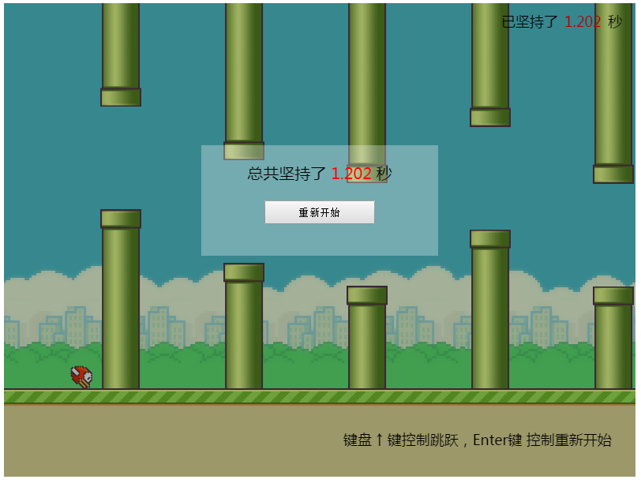

## fladdyBirds

- 作者：Tetegw

- 描述：fiaddyBirds小游戏
- 调用：
```javascript
var game = Fly.Game({
    wrapId: 'fladdybirds',			//必填 （默认'fladdybirds'）
    speed : 15						//可选 （默认15）
});
```

- HTML要求：
```xml
<div id="fladdybirds"></div>	 	//宽800px，高600px
```

## 效果如下


